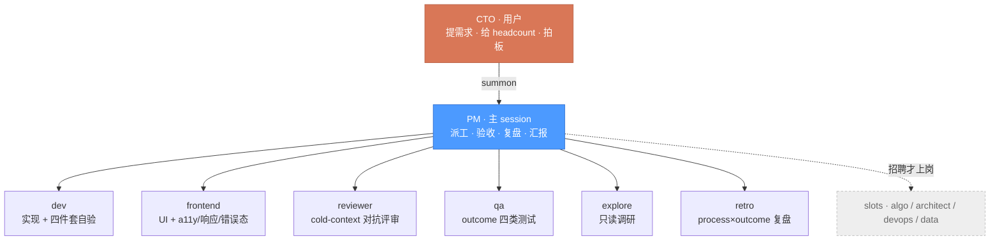
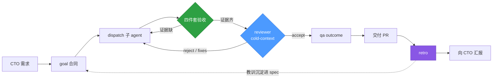

<div align="center">

# kucai-agentic-orchestration

**一套纪律驱动的 Claude Code 多-agent 研发编排模板**

*A discipline-driven multi-agent software org that runs inside Claude Code.*


</div>

> **想把这套编排装进另一个项目？** 让那个项目的 Claude Code session 读 **[BOOTSTRAP.md](BOOTSTRAP.md)** —— 一份自包含的 install 指令，照着执行就能原样重建（含 native 格式 + 重启注册 + binding 纪律 + 已知坑），无需访问本 repo。

---

## 这是什么 · What is this

把一家 **AI 软件公司的研发线**收进一个 repo：

- 你是 **CTO** —— 提项目背景 + 需求，给 headcount，拍板。
- 一个 **PM**（= 在本 repo 打开 claude 的主 session）—— 拆任务、写派工合同、dispatch 子 agent、验收产出、维护看板、向你汇报、每件 closed work 召复盘。**PM 不直接写产品代码。**
- 一队 **native 子 agent** —— dev / reviewer / qa / frontend / explore / retro，各有边界、各有不能做的事。

> **模板的价值不是文件结构，是 binding 纪律** —— 让"做完了"必须被证据证明，让评审独立而有效，让复盘真正改进下一轮。

---

## 团队架构 · Org



| Agent | 何时派 | 关键纪律 | 能写 |
|---|---|---|---|
| `dev` | 实现功能 / 修 bug / 写单测 | Implemented≠Verified 四件套 | `src/` `tests/` |
| `frontend` | 前端 UI + 交互 | a11y / responsive / 错误态三件套 + 视觉证据 | UI 层 |
| `reviewer` | PR 评审 | cold-context · 工具层无 Write · 零 commit-fix | *只读* |
| `qa` | outcome 验收 | golden / edge / error / regression 四类 | `tests/` |
| `explore` | 只读调研 | 只 surface 事实、带 source、不做判断 | *只读* |
| `retro` | closed work 复盘 | process×outcome 四象限 + 教训→spec 改动 | `journal/post_mortems/` 等 |

> **Slot**（`algo` / `architect` / `devops` / `data`）= 储备草稿，**未注册**。招聘 = 写 hire case → CTO 拍板 → 复制进 `.claude/agents/`。按需扩编，不冗余。

---

## 工作循环 · Workflow



> **派工必走 goal 合同**，不口语化派工 —— 否则 reviewer/retro 无法独立判断，团队失去可追溯的判断依据。

---

## 核心纪律 · Binding discipline

> 这几条是非协商的，是这套编排能挡住问题的根本。完整 10 条见 [memory/team-operating-model.md](memory/team-operating-model.md)。

| 纪律 | 一句话 |
|---|---|
| **Implemented ≠ Verified** | 说"做完了"必须给四件套证据：git 干净 · 真实 commit · 测试 pass · 冷启动复跑。PM 信证据不信自报。 |
| **Process ≠ Outcome** | 复盘分两次评分：好结果坏过程 = 走运（不奖励），坏结果好过程 = 倒霉（不改流程）。拒绝塌缩成"上线了 = 好"。 |
| **Cold-context 对抗评审** | reviewer 只读 diff，不读 dev 的"为什么"；工具层无 Write，不下场改代码（零例外）。 |
| **owned_paths 边界** | 每个 agent 只写自己的目录，越界 raise PM、不擅自扩 scope。 |
| **n=1 不改默认** | 1 次 = 轶事，30 次 = 信号。教训没有 ≥2 例同向支撑，只标 OBSERVATION。 |
| **No 平话** | 每条教训必须翻成具体 spec / 行为改动，否则等于没学到。 |

---

## 实战验证 · Validation

> 模板 v1.0 已完成一次真实任务压测：给一个 macOS 录音 app（外部 repo）加"查看原始转录"功能。

完整链路跑通：`explore → dev → reviewer → dev → reviewer → dev → PM 终验 → 交付 PR → retro`。cold-context 评审两轮独立发现真问题：

| 轮次 | 发现 | 性质 |
|---|---|---|
| 首审 | dev 自标的 2 个不确定点，reviewer 在**未被告知**的前提下独立命中 | 设计兑现 |
| 二审 | 修复轮*新引入*的一个 data race，被一条"看起来线程安全"的注释掩盖 | 高危 · 潜伏 |
| 二审 | 一个自指（tautology）测试：被测代码改坏也不会失败 | 高危 · 潜伏 |

**误报率 ≈ 0**（约 13 条 findings，无一是对不存在问题的告警）。其中假测试一条由 dev 事后用 fault-injection 客观证伪，不依赖任何主观判断。

> 复盘同样受纪律约束：retro 将本轮判为 `earned win`，但保留 outcome 星号 —— GUI 行为仅有手动测试计划、未经人工执行，不因"PR 已提交"给满分。

---

## 快速开始 · Quick start

```bash
# 1. 以本模板为根开发，或 clone 进你的项目
git clone <this-repo> && cd <your-project>

# 2. 改 ORG.md：项目名 / 想留或砍的 agent
# 3. 启动——主 session 自动载入 CLAUDE.md，你就是 PM
claude
```

启动后跑**启动 SOP** → CTO 给第一个 goal（一句话即可）→ PM 自动走 `写合同 → 派工 → 四件套验收 → reviewer 二审 → 推看板 → 召 retro → 汇报`。

> **注意**：native agent 只在 session 启动时注册。新建 / 改完 `.claude/agents/*.md` 后**必须重启 claude**，并在 available-agents 列表里确认 `dev` / `reviewer` 等已出现（不要靠"调用成功"判断 —— 会撞内置 `Explore` 给假阳性）。
>
> **装进别的项目** → 用 **[BOOTSTRAP.md](BOOTSTRAP.md)**。

---

## 结构 · Structure

```
CLAUDE.md                        # PM 操作手册（主 session 自动载入）
BOOTSTRAP.md                     # 装进别的项目的 install 指令
.claude/agents/<role>.md         # 6 个 active 子 agent（native 单文件 + frontmatter）
templates/slot-agents/<role>.md  # 4 个 slot 草稿（未注册，招聘时复制进 .claude/agents/）
ORG.md                           # 花名册 + headcount + 招聘纪律
memory/
  team-operating-model.md        # 运营哲学 + 角色边界 + binding 总册
  eng-lessons.md                 # 累积工程教训（retro 写）
state/
  INBOX.md                       # URGENT / FYI / WAITING
  board.md                       # sprint 看板
  calibration.json               # 估时 / 质量预测准度
journal/
  decisions/                     # PRD / 选型 / scope / 招聘（PM 写）
  post_mortems/                  # 复盘（retro 写）
  reviews/  qa-reports/          # reviewer / qa 产出归档
goals/GOAL_TEMPLATE.md           # 派工合同模板
```

---

## 灵感来源 · Inspiration

| 来源 | 借鉴了什么 |
|---|---|
| 资管 desk 内部实践 | process ≠ outcome · 跟踪 rejected · n=1 不改方向 · 边界硬 |
| [evolab/cto-orchestration](https://github.com/martin1847/evolab/tree/main/skills/cto-orchestration) | goal 文档强制结构 · Implemented ≠ Verified 四件套 · cold-context 评审 |
| [bernstein](https://github.com/sipyourdrink-ltd/bernstein) | `owned_paths` 边界 · role spec 结构 · bulletin board |
| [claude-squad](https://github.com/smtg-ai/claude-squad) | 一 agent 一 worktree 硬隔离 |

**明确不采用**：tmux send-keys 编排载体（用原生 Agent tool）· HMAC 审计链（git history 已足够）· "编排者绝不写代码"铁律（PM 可 ≤5 行 surgical）· 合规级 runtime 子系统（超出范围）。

详细取舍：[journal/decisions/](journal/decisions/)（含 [模板设计](journal/decisions/2026-06-26_template_design.md) + [native wiring 迁移](journal/decisions/2026-06-26_native_agent_wiring.md)）。

---

<div align="center">

**v1.0** · 私有 @ Colin131 · 已通过首次真实任务压测

*Built with [Claude Code](https://claude.com/claude-code) · 运营哲学见 [team-operating-model](memory/team-operating-model.md)*

</div>
